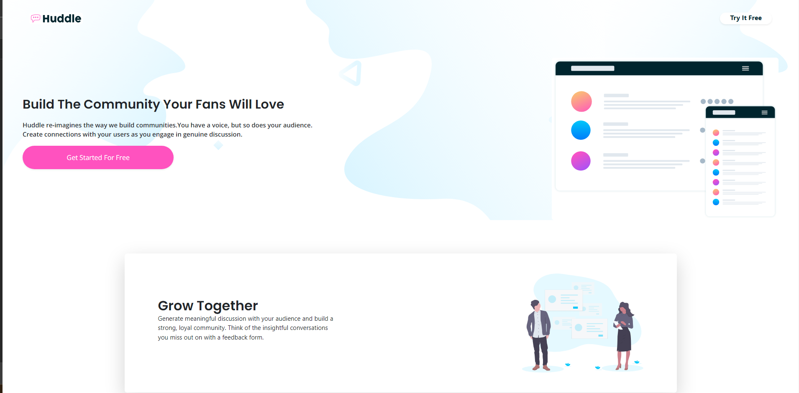

# Frontend Mentor - Huddle landing page with alternating feature blocks solution

This is a solution to the [Huddle landing page with alternating feature blocks challenge on Frontend Mentor](https://www.frontendmentor.io/challenges/huddle-landing-page-with-alternating-feature-blocks-5ca5f5981e82137ec91a5100). Frontend Mentor challenges help you improve your coding skills by building realistic projects.

## Table of contents

- [Overview](#overview)
  - [The challenge](#the-challenge)
  - [Screenshot](#screenshot)
  - [Links](#links)
- [My process](#my-process)
  - [Built with](#built-with)
  - [What I learned](#what-i-learned)
  - [Continued development](#continued-development)
  - [Useful resources](#useful-resources)

## Overview

In this project was build a fully responsive website for building communities.

### The challenge

Users should be able to:

- View the optimal layout for the site depending on their device's screen size.

### Screenshot

### Links

- Live Site URL: [Add live site URL here](https://miron-silviu.github.io/huddle-landing-page/)

## My process

I created the components in index.html and I used bootstrap to style those components and then I used css to complete the style process.

### Built with

- Mobile-first workflow
- Semantic HTML5 markup
- CSS custom properties
- Flexbox
  -css responsive design

### What I learned

I learned how to use bootstrap classes, and how to import from bootstrap using a direct link.

### Useful resources

- [Example resource 1](https://michalsnik.github.io/aos/)
